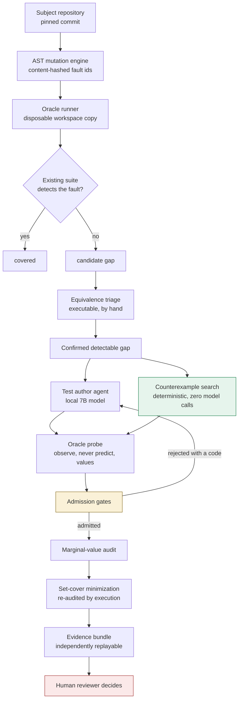

# Placebo

**Placebo is a test-suite auditor that tells a reviewer which generated tests actually earn their place.** It measures what a test would catch that nothing else already catches, then proposes a smaller patch carrying executable evidence for every test it keeps.

It runs entirely on a local 7B model on a consumer laptop GPU. No API key, no credentials in the repository, zero cost per run.

| | |
|---|---|
| **Repository** | https://github.com/RajdeepKushwaha5/Placebo |
| **Verify in 3 minutes** | `pytest tests` then `python scripts/check_consistency.py` |
| **Status** | 80 unit tests, 102 consistency checks, 2 evidence bundles replaying clean |

The honest post-hackathon plan, including the requirements for calling this a
general product, is in [`docs/PRODUCT_ROADMAP.md`](docs/PRODUCT_ROADMAP.md).

---

## Table of contents

1. [The problem](#1-the-problem)
2. [Demo](#2-demo)
3. [How well does it work](#3-how-well-does-it-work)
4. [Testing and consistency](#4-testing-and-consistency)
5. [Quickstart](#5-quickstart)
6. [Configuration and data](#6-configuration-and-data)
7. [Architecture](#7-architecture)
8. [Project structure](#8-project-structure)
9. [Decisions and trade-offs](#9-decisions-and-trade-offs)
10. [CI](#10-ci)
11. [Improvement changelog](#11-improvement-changelog)
12. [Main failure mode](#12-main-failure-mode)
13. [Hot take](#13-hot-take)
14. [Safety and scope](#14-safety-and-scope)

---

## 1. The problem

### Who has it

A tech lead or maintainer on a team that has adopted an AI coding assistant.

### What goes wrong

The repository fills with generated tests. Test count rises. Coverage rises. CI stays green. Nobody can say which of those thousands of assertions would actually catch a regression.

The failure is quiet and specific. An assistant can read the implementation and
encode its current behavior, including an existing mistake, as the expected
answer. The result goes green and raises coverage, yet may add little or no new
regression sensitivity. Implementation-aware tests are not automatically bad;
the problem is that ordinary CI does not show which ones added protection.

### Why coverage does not help

Coverage measures which lines executed. It never asks whether any assertion would have objected had the answer come back wrong. A suite can reach 100 percent coverage and still miss real defects, which is not a hypothetical:

| suite | tests | line and branch coverage | injected faults detected |
|---|---:|---:|---:|
| `python-semver` 3.0.4, written by its maintainers | 329 | **100.0%** | **96.2%** (178/185) |

Seven faults survived a suite held at full coverage. Manual triage confirms six are behaviorally detectable gaps and one is an equivalent mutant sitting in dead code.

### The question Placebo answers

Not "does this test pass". Not "did coverage go up". Instead:

> **What regression becomes detectable only because this test exists?**

That question is counterfactual, so the answer is a subtraction rather than a total:

```
value(test) = faults detectable with it  minus  faults detectable without it
```

---

## 2. Demo

### The audit, on 33 tests written by this project's own agents

```console
$ placebo audit artifacts/suites/as_generated_patch.py --minimize

  33 tests in as_generated_patch.py, audited against 185 fault models

    REDUNDANT_WITH_EXISTING  test_ai_d_01
    VALUABLE                 test_ai_gap_02
    HARMFUL                  test_ai_raw_04
    ... 30 more

      1 add unique fault detection the existing suite lacks
      3 duplicate a sibling test in this patch
     18 only re-detect what the repo already detects
      0 show no marginal sensitivity under these fault models
     11 are red or unstable against correct code

    gaps closed by this patch : 3
    review burden reduction   : 94%

    minimized patch -> as_generated_patch.minimized.py
    (2 of 33 tests, preserving 3 measured novel faults)

  Human approval required before merging. Placebo proposes; it does not merge.
```

One test out of thirty-three is the sole reason a fault would be caught. The patch shrinks from 33 tests to 2 while still detecting the same three faults, and the reduced patch is re-audited by execution rather than assumed to be equivalent.

### Other commands

```console
$ placebo gaps                     # what the existing suite fails to detect
$ placebo explain test_placebo_01  # why does this generated test exist?
$ placebo verify --bundle artifacts/bundle   # re-execute every recorded claim
```

`gaps` and `explain` return instantly. A rendered, self-contained evidence page is at [`artifacts/evidence.html`](artifacts/evidence.html); every bar shows how many faults a test catches, with the green segment showing how many only it catches.

---

## 3. How well does it work

Four independent lines of evidence, deliberately not all resting on mutation score.

### 3.1 The headline comparison

Twenty-nine faults were frozen and fingerprinted **before** any generation ran, and the agent never saw them. Every condition uses the same model, the same faults, the same admission gates and the same model-free repair step. Only the scaffolding differs.

| condition | scaffolding | tests kept | confirmatory kill (n=29) | all-eligible (n=80) |
|---|---|---:|---:|---:|
| `baseline_A` | direct prompt, no fault shown | 0 | **0%** | 0% |
| `mutant_aware_B1` | shown the fault, one attempt | 3 | 14% | 8% |
| `placebo_B` | plus verification retry loop | 5 | 17% | 19% |
| `placebo_C` | implementation body withheld | 4 | 21% | 18% |
| **`placebo_D`** | **oracle-grounded** | **7** | **31%** | **31%** |

The baseline retaining zero tests is a measured outcome, not a strawman. All twelve candidates were offered; eleven failed against correct code and one would not parse. Token counts ran 170 to 538 against a 900-token cap, so nothing was truncated by the harness. Full disposition is in [`artifacts/report.md`](artifacts/report.md).

### 3.2 Closing real gaps: the model was never the bottleneck

After oracle grounding removed wrong expected values, one failure mode remained. The agent chose inputs where correct and faulty code produce the same answer. Searching an input space is enumeration, not a language task, so the search was moved out of the model entirely.

| approach | real gaps closed | model calls | wall time |
|---|---:|---:|---:|
| agent with oracle grounding | 3 of 6 | 13 | 512 s |
| **plus deterministic counterexample search** | **6 of 6** | **0** | **36 s** |

The existing 329-test suite stays green alongside the generated patch. Witnesses the search found that the model never proposed:

```python
semver.Version.parse("0.0.0").match(">=0.0.0")     # True  becomes False
semver.Version.parse("0.0.0+0").is_compatible(...) # True  becomes False
semver.Version.parse(3.14)                         # only the error message differs
```

That last one matters. Both versions raise `TypeError`, so `pytest.raises(TypeError)` structurally cannot separate them. Only asserting the observed message detects it.

### 3.3 Real historical bugs, not injected ones

Mutation score is a proxy. To test outside it, defects that genuinely shipped in `semver` 3.0.4 and were fixed upstream afterwards were used, with the maintainers' own diffs and issue numbers as ground truth.

| upstream issue | defect | outcome |
|---|---|---|
| `#460` | `bump_prerelease` does not always produce a newer version | witness found |
| `#469` | `next_version` does not bump build-only versions | witness found |
| `#339` | `next_version` does not reset prerelease when the token changes | witness found |
| `#463` | duplicate dead code in `bump_build` | correctly **no** witness |

**3 of 3** behavior-changing bugs found, with zero model calls. `semver`'s own 329 tests detect **none** of them.

Issue `#463` is the interesting one. It removes dead code, so finding no witness is the correct answer, and it independently confirms the equivalent-mutant verdict this project reached from the other direction. Placebo flagged that block unkillable; upstream deleted it in January 2025.

### 3.4 A second repository

| subject | domain | tests | faults | mutation score |
|---|---|---:|---:|---:|
| `semver` | version comparison and boundary logic | 329 | 185 | **96.2%** |
| `inflection` | string transformation | 455 | 76 | **85.5%** |

The scores differ substantially, which is the useful part. The method reports a property of each suite rather than returning a constant.

### 3.5 Oracle strength against detection power

| oracle level | hardcodes expected values | confirmed gaps detected |
|---|:--:|---:|
| level 4, execution snapshot | yes | **6 of 6** |
| level 3, metamorphic properties | **no** | 1 of 6 |

All twelve metamorphic properties were verified sound on clean code. The result went against expectation and is reported rather than resolved: the stronger oracle is the weaker detector. Snapshot witnesses close every gap but pin behavior rather than correctness. Metamorphic properties close far fewer but cannot encode an existing bug as expected.

### 3.6 Run-to-run variance

Three independent repeated runs of one condition, percentile bootstrap over the observed values:

| measure | values | median | 95% CI |
|---|---|---:|---|
| candidates admitted | 5, 5, 5 | 5.0 | [5.0, 5.0] |
| cases recovered by retry | 1, 0, 2 | 1.0 | [0.0, 2.0] |

The asymmetry is the finding. The outcome is stable while the mechanism credited for it is not, which is exactly why no strong claim is made for the retry loop.

The headline table compares single runs, so the two ends of it were then repeated three times each on the same 12-fault subset:

| condition | faults admitted of 12 | median | 95% CI |
|---|---|---:|---|
| `baseline_A` | 1, 0, 0 | 0.0 | [0.0, 1.0] |
| `placebo_D` | 6, 7, 7 | 7.0 | [6.0, 7.0] |

The ranges do not overlap. The worst `placebo_D` run still admitted six times what the best `baseline_A` run did, so the gap between the ends is larger than run-to-run noise. This is a subset rather than the 29-fault confirmatory split, three runs give a wide interval, and the two middle conditions were not repeated, so nothing is claimed about the ordering between them. Data in [`experiments/seeds.json`](experiments/seeds.json).


### 3.7 The compute control

The best condition spends more model calls than the baseline, which invites the
obvious objection: maybe the scaffolding does nothing and the extra attempts do
the work. Giving the plain prompt the same budget as independent draws settles
it.

| approach | model calls | faults detected |
|---|---:|---:|
| direct prompt, 3 independent draws | **36** | 3 of 12 |
| oracle-grounded scaffolding | **23** | **7 of 12** |

The resampled baseline spent more compute and detected fewer faults. Extra
attempts are not the mechanism.

---

## 4. Testing and consistency

```console
$ python -m pytest tests
80 passed

$ python scripts/check_consistency.py
102/102 checks pass
```

The 80 unit tests guard the parts that carry claims: mutant identity must be content-derived and stable, the held-out split must not leak, the admission gates must reject tests that cheat, minimization must never drop a fault, and the repository contract must fail with an actionable reason rather than a traceback. The counterexample search is covered there too: its candidate pool must stay deterministic and put relevant probes ahead of merely short ones, and a synthesized test must assert an observed error message rather than an exception type alone. Both of those are regression tests for mistakes that were made and measured, not hypotheticals.

`check_consistency.py` is the more unusual one. It re-derives every headline number from the stored artifacts and fails if the writeup drifts from the data. It is what caught a stale report contradicting its own raw results, and it runs in CI so the drift cannot return.

Both evidence bundles are independently replayable:

```console
$ python scripts/verify_bundle.py --bundle artifacts/bundle
  7/7 claims hold
$ python scripts/verify_bundle.py --bundle artifacts/real-gap-bundle
  3/3 claims hold
```

---

## 5. Quickstart

**Requirements:** Python 3.11 or newer (3.13.0 used here). No GPU and no API key needed for the central result.

```bash
git clone https://github.com/RajdeepKushwaha5/Placebo.git
cd Placebo
python -m pip install -r requirements.lock
python -m pip install -e .

python -m pytest tests             # 80 passed
python scripts/check_consistency.py   # 102/102 checks pass
```

### Reproduce the central claim without a model

```bash
python scripts/run_census.py --workers 6     # about 2 minutes
python scripts/triage_survivors.py
```

Expected output:

```
  mutants enumerated : 185
  killed             : 178
  SURVIVED (triage)  : 7
  mutation score     : 96.2%
```

Then triage confirms 6 detectable gaps and 1 equivalent mutant.

### Reproduce the evidence that does not depend on mutation score

Every command below is deterministic and makes zero model calls.

```bash
python scripts/run_gap_search.py        # 6/6 real gaps, about 36 s
python scripts/run_historical_bugs.py   # 3/3 real bugs, about 1 s
python scripts/run_multirepo_census.py  # both subjects, about 4 min
python scripts/run_metamorphic.py       # level-3 oracle, about 7 s
python scripts/run_variance.py          # bootstrap intervals, instant
```

### Optional: the full agent comparison

This part needs a local model.

```bash
# install Ollama from https://ollama.com, then:
ollama pull qwen2.5:7b
python scripts/run_pipeline.py --conditions baseline_A placebo_D --limit 12
```

Full details, expected outputs and runtimes for every path are in [`docs/REPRODUCTION.md`](docs/REPRODUCTION.md).

---

## 6. Configuration and data

There is nothing to configure. No `.env` file, no API keys, no external services.

| input | where it comes from |
|---|---|
| Subject code under test | vendored at a pinned commit in `subject/` and `subjects/` |
| Fault corpus | generated deterministically by the AST engine, not stored input |
| Model | local Ollama at `http://127.0.0.1:11434`, only for the agent conditions |
| Dependencies | three pinned packages in `requirements.lock` |

```
pytest==9.0.2
pytest-cov==7.1.0
coverage==7.16.0
```

Placebo's own engine imports only the Python standard library (`ast`, `tokenize`, `subprocess`, `hashlib`).

Model settings, when used, are pinned and recorded in every evidence bundle: `qwen2.5:7b`, quantization `Q4_K_M`, digest `845dbda0ea48ed74...`, `temperature=0`, `seed=7`, `num_ctx=8192`.

---

## 7. Architecture



### What each stage guarantees

| stage | guarantee |
|---|---|
| **Mutation engine** | fault ids are `sha256` over commit, file, function, operator, span and replacement, so enumeration order cannot change them and a split can be frozen |
| **Oracle runner** | every execution happens in a disposable copy; a mutated file is always restored |
| **Triage** | equivalent mutants are excluded from scoring rather than counted as failures |
| **Oracle probe** | expected values are observed by executing the reference, never predicted by the model |
| **Admission gates** | a test is admitted only if it passes on clean code **and** fails on its specific fault, both verified by pytest |
| **Audit** | value is measured against the existing suite and against sibling tests at once |
| **Minimization** | a set cover over novel faults, then re-audited by execution to confirm no loss |

### The admission gate sequence

```
candidate test
    |
    +-- static checks ......... parses, defines a test, has an assertion,
    |                           no skip/xfail/mock/subprocess/source inspection
    +-- collection ............ pytest can import it
    +-- clean HEAD ............ passes against correct code
    +-- target fault .......... FAILS with the fault injected
    +-- causal check .......... failure is behavioral, not an import error
    +-- repeat stability ...... same verdict across runs
    |
    v
admitted, with the fault it detects recorded alongside it
```

Anything that fails a gate is rejected with a structured code (`CLEAN_HEAD_FAILED`, `TARGET_MUTANT_SURVIVED`, `FORBIDDEN_PATTERN`, and eight more). Those codes are what made the project's central finding visible, because they turned "it did not work" into a distribution.

---

## 8. Project structure

```
placebo/
├── src/placebo/
│   ├── cli.py                     audit / gaps / explain / verify
│   ├── mutation/
│   │   ├── engine.py              AST fault injection, surgical one-token spans
│   │   ├── models.py              content-hashed fault identity
│   │   ├── census.py              parallel suite-versus-fault sweep
│   │   └── split.py               frozen, fingerprinted held-out split
│   ├── verification/
│   │   ├── runner.py              the oracle: does the suite detect this fault?
│   │   ├── admission.py           gate sequence and rejection codes
│   │   └── prober.py              observe values by execution, sandboxed
│   ├── audit/marginal.py          counterfactual value, set-cover minimization
│   ├── search/
│   │   ├── counterexample.py      deterministic input search, zero model calls
│   │   └── metamorphic.py         level-3 oracle, twelve properties
│   ├── agents/                    local model client and test author
│   ├── evaluation/                suite assembly, model-free repair, scoring
│   └── evidence/bundle.py         replayable evidence bundles
│
├── scripts/                       one entry point per experiment (25 files)
├── tests/                         80 tests guarding the load-bearing parts
│
├── subject/                       vendored semver 3.0.4 (BSD-3), pinned
├── subjects/inflection/           vendored inflection 0.5.1 (MIT), pinned
│
├── artifacts/
│   ├── report.md                  generated comparison report
│   ├── evidence.html              self-contained visual evidence page
│   ├── census_summary.json        the 96.2% headline
│   ├── survivor_triage.json       6 real gaps, 1 equivalent
│   ├── bundle/                    benchmark evidence bundle
│   └── real-gap-bundle/           real-gap evidence bundle
│
├── experiments/                   every stored result as JSON
├── trajectories/                  6 rendered agent walkthroughs plus raw JSONL
└── docs/
    ├── REPRODUCTION.md            exact commands, expected output, runtimes
    └── LIMITATIONS.md             written to help a reviewer find weak points
```

---

## 9. Decisions and trade-offs

### A custom mutation engine instead of mutmut or cosmic-ray

`mutmut` requires `os.fork()`, which does not exist on Windows, and standardizing on Docker purely to obtain a mutation tool would raise the bar for anyone reproducing the work. More importantly, both tools address mutants by session ordering, and a held-out split cannot be frozen against an identifier that changes between runs.

The cost is roughly 400 lines of engine to maintain and a smaller operator set than a mature tool. The benefit is content-derived fault identity, which the entire evaluation depends on.

### A local 7B model instead of a hosted frontier model

The claim under test is about scaffolding, not about model strength. Every condition is paired on the same model, so the relative finding holds. A local model also means judges reproduce results with no API key, no credentials in the repository and no spend.

The cost is lower absolute numbers and a baseline weak enough to be worth flagging. That is stated rather than hidden.

### Observe expected values instead of predicting them

Measurement drove this. In the mutant-aware condition, 18 of 21 rejections were the model asserting a wrong expected value, and it could not repair them even when handed the exact assertion diff. Executing the reference removes that entire failure class by construction.

The trade-off is real and is the project's sharpest limitation. A snapshot pins behavior against change, not against error. If the implementation is already wrong, the witness records the wrong answer as expected.

### Deterministic search instead of more model attempts

The residual failure was input choice, and enumeration does that better than language. The search is fully deterministic with a fixed cost-ordered candidate pool, so results cannot be re-rolled until they look good.

The cost is that the input domain is hand-designed for this subject. Generalizing it to an arbitrary repository is unsolved and is listed as future work.

### Minimization as set cover instead of a per-test filter

The first minimizer kept only tests flagged `VALUABLE`. When several sibling tests detect the same fault each one looks redundant, so dropping them all loses the fault. The tool's own output exposed this by reporting three faults covered alongside a one-test patch, which is arithmetically impossible. Minimization is now a greedy set cover, verified afterwards by re-executing the reduced patch, with three regression tests.

---

## 10. CI

[`.github/workflows/placebo.yml`](.github/workflows/placebo.yml) runs on every push and pull request.

**No language model runs in CI, by design.** Putting an LLM in the hot path makes every build nondeterministic, slow and dependent on a provider staying up. What CI should do is re-execute evidence that already exists and fail if any claim stops holding.

| step | what it proves |
|---|---|
| unit tests | the engine still behaves |
| mutation census | the 96.2% figure still reproduces |
| survivor triage | 6 gaps and 1 equivalent still hold |
| counterexample search | 6 of 6 still closes with zero model calls |
| bundle replay | every recorded claim still holds |
| consistency check | the writeup still matches the data |
| report drift guard | fails if `artifacts/report.md` is stale relative to committed results |

That last step is the one worth stealing. It makes a stale number a build failure rather than something a reviewer has to catch.

---

## 11. Improvement changelog

Every row is an experiment that was run, with the evidence that decided what happened next. Three rows are negative results that changed the design.

| # | What was tried, and why | Evidence | Decision |
|---|---|---|---|
| **Baseline** | Direct prompt: show the function, ask for a test, keep whatever passes. | 12 offered, **0 retained**, 0/29. Eleven failed on correct code, one malformed. Outputs 170 to 538 tokens against a 900 cap, so nothing was truncated. | Established the floor, and the floor is zero. |
| **1** | **Mutation-guided context.** Show the one-line diff of a known-detectable fault, isolating context as the variable. | 3/12 admitted; 4/29 confirmatory | **Kept.** Targeting a concrete behavioral difference beats asking for more tests. |
| **2a** | **Verification retry loop.** Feed structured rejection codes back, allow three attempts. | 5/12; 2.4x the model time | **Investigated.** The gain looked suspiciously small. |
| **2b** | **Diagnosis.** Most rejections were wrong expected values. The loop ran pytest with `--tb=no`, so feedback carried no assertion detail. Fixed to `--tb=short`. | Three stored runs admitted 5/12 each, but retry recoveries varied **0, 1 and 2** under identical settings | **Negative result.** Better feedback helps inconsistently. Retry is not the contribution. |
| **3** | **Contract grounding.** Withhold the implementation body so current behavior cannot be copied. | 6/29 confirmatory but 14/80 all-eligible, below the retry condition | **Mixed.** Isolation removed useful context along with the harmful part. |
| **4** | **Oracle grounding.** Stop asking for a value that can be computed. The model proposes inputs; execution supplies the expected values. | 7/12 admitted; **9/29** and **25/80**; `CLEAN_HEAD_FAILED` eliminated entirely | **Kept.** An entire failure class removed by construction. |
| **5** | **Marginal-value audit.** Score every test counterfactually against the existing suite and its siblings, one execution per fault. | 33 tests audited: **1** sole detector, 3 sibling-redundant, 18 already covered, 11 red. Minimized 33 to 2 preserving the same 3 faults, verified by re-execution. | **Kept, and it reframed the project.** Placebo audits tests rather than only generating them. |
| **5b** | **Bug found by the audit's own output.** The first minimizer kept only `VALUABLE` tests, which loses any fault several siblings share. | Reported 3 faults covered alongside a 1-test patch, an impossibility | **Fixed.** Greedy set cover, post-hoc verification, three regression tests. |
| **6** | **Deterministic counterexample search.** The residual failure was input choice, so enumeration replaced the model for that step. | Real-gap closure **3/6 becomes 6/6**, with **0 model calls** and 36 s | **Kept.** The largest improvement in the project, and it removed the model from the loop rather than adding to it. |
| **Removed** | **Contract-only isolation as the final architecture.** Intended to stop implementation copying, it hid context the input search needed. | 6/29 beat the retry condition while 14/80 trailed it; oracle grounding beat both | **Removed** from the recommended configuration. |

---

## 12. Main failure mode

**Expected values are a snapshot of current behavior, not verified correctness.**

Oracle grounding runs the chosen input against the reference implementation and records whatever came back. That guarantees consistency with the current implementation, not correctness with respect to intent. If `semver` already contained a bug on some input, Placebo would faithfully record the buggy output as expected, and the resulting test would lock that bug in. This is the same implementation-copying failure the project criticizes in AI-written tests, displaced one level.

What a witness pins is behavior against **change**, not against **error**. That is genuinely useful for regression detection and genuinely insufficient for correctness.

The oracle hierarchy this should eventually use:

| level | oracle | strength | implemented |
|---|---|---|:--:|
| 1 | explicit specification, examples, invariants | correctness with respect to intent | no |
| 2 | agreement between independent implementations | correctness by cross-check | no |
| 3 | metamorphic properties | correctness of relationships, no hardcoded outputs | **yes** |
| 4 | single-reference execution snapshot | consistency only | **yes, and used by default** |

Level 3 exists and works, and measurably detects fewer faults than level 4. Both numbers are reported. Nothing in this repository is a correctness proof, which is why the word "proof" is avoided in favor of **executable witness**.

---

## 13. Hot take

> **Do not ask a language model to search. Ask it what to search for.**

The two largest gains in this project both came from taking work **away** from the model, and both were found by reading rejection-code distributions rather than by intuition.

The first was value prediction. The model kept guessing return values that the implementation could simply be executed to obtain. That was 18 of 21 rejections, and it was eliminated by construction rather than by prompting.

The second was input search. With values fixed, the agent still closed only 3 of 6 real gaps because it could not find inputs where correct and faulty code diverge. A deterministic enumerator over the same space closed **6 of 6, with zero model calls, in 36 seconds**.

A language model is good at knowing where to look. It is bad at looking. Those are different jobs, and handing both to the same component is why a lot of agent engineering underperforms.

The corollary, and the reason the audit exists:

> **Do not count tests. Account for them.**

Every metric in common use is a total. Totals cannot say whether a test earns its place, because that question is counterfactual. Thirty-three tests, two needed, and nothing on a normal dashboard would have shown it.
## 14. Safety and scope

- **Production code is never modified.** A patch-scope gate rejects any candidate touching anything outside the generated-test path, and the runner restores the original file after every mutation.
- **Nothing merges automatically.** Output is a proposal for a qualified human reviewer. The evidence bundle exists so that review is cheap.
- **Execution is sandboxed.** Everything runs in a disposable workspace copy, never in the source tree.
- **The oracle probe is constrained.** Model-proposed expressions are validated against a small AST allowlist and executed with a minimal builtins whitelist. Imports, file access, dunder attributes and process control are rejected. This is not an OS-level boundary; production use against untrusted providers should add a networkless container with resource limits.
- **Static gates reject cheating.** Candidates using `skip`, `xfail`, mocks, `subprocess`, sockets, `eval`, `exec` or source inspection are refused.
- **Public data only.** Both subjects are public, permissively licensed libraries. No private data, no credentials, no personal information.
## License

MIT for Placebo's own code. See [`LICENSE`](LICENSE). Vendored third-party subjects keep their original licenses.
